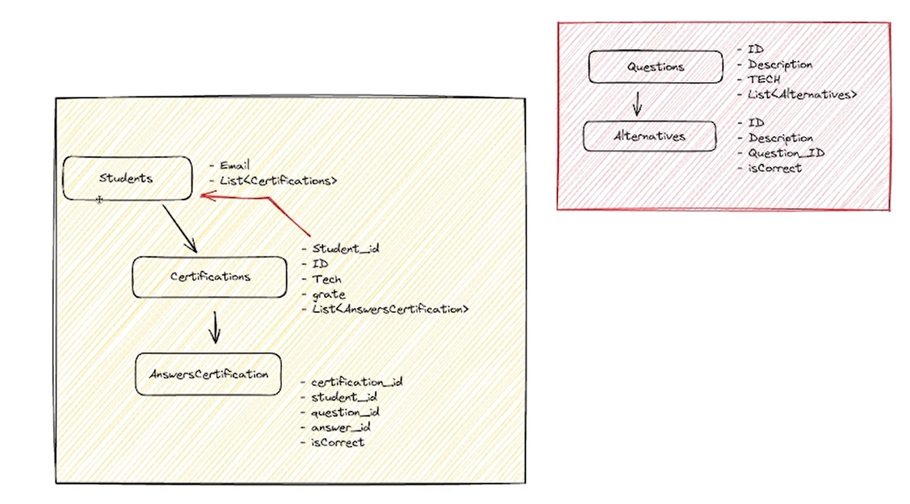
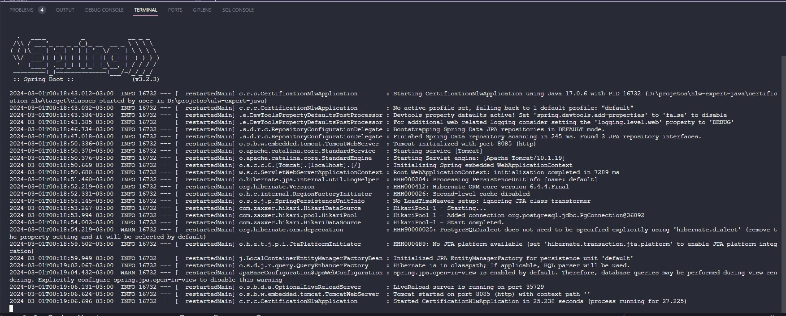
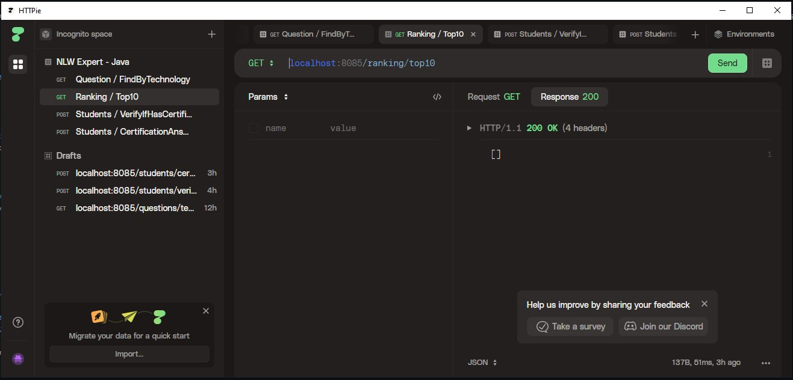

## Construindo o Projeto 🧱

Neste projeto, estamos construindo uma aplicação utilizando Java e Spring. Essa API vai simular uma funcionalidade onde os usuários podem fazer testes de certificação. Eles inserem seu email, escolhem o tema do teste e respondem às perguntas. No final, eles recebem suas notas e podemos gerar um ranking dos 10 melhores alunos.

## Ferramentas utilizadas 🛠

## Dificuldade do Projeto ⭐⭐

## End Points

Para acessar os endPoints da aplicação, [clique aqui](./certification_nlw/endPoint/postman-collection.json) e faça o download do arquivo. 
Utilize a ferramenta de gerenciamento de API´s da sua preferencia. Para este projeto, utilizei o HTTPie.

---
 

 

⚙ O desenvolvimento de software é uma arte em constante evolução - nunca se contente com o suficiente. ⚙
